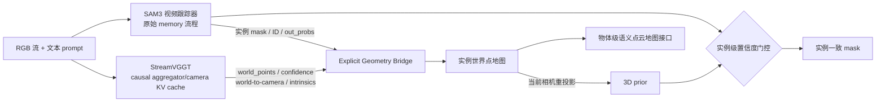

# 双框架显式耦合方案

此前 layer-17 实验中 aligned 与 shuffled 的结果接近，说明“加入非零几何特征”
有收益，但尚未证明模型使用了正确的跨帧几何对应。因此本目录把时空对应变成
显式投影，并将 `aligned > zero` 且 `aligned > shuffled` 设为继续扩展的必要条件。

## 当前已实现

1. SAM3 只在参考帧接收一次由 GT instance 生成的 box prompt，之后使用原版视频 memory。
2. StreamVGGT 逐帧运行 causal cache，输出共享世界坐标点、置信度和相机。
3. 可靠 SAM3 mask 在 pointmap 上采样，更新由 instance ID 索引的历史 3D 点集。
4. SAM3 低置信时，将历史实例点投影到当前视角作为恢复 mask。
5. `zero / aligned / shuffled` 共用完全相同的 SAM3 和 StreamVGGT 前向结果。
6. 使用 GT mask 计算静态实例重心漂移，只做相机约束可行性诊断。

## 后续顺序

只有当 `aligned` 稳定优于 `zero` 且明显优于 `shuffled` 后，才继续：

1. 将 3D prior 作为纠错 prompt 送回 SAM3 mask decoder，而不是直接作为最终 mask。
2. 用几何重投影位置编码替换/补充 SAM3 memory 的纯 2D 位置编码。
3. 增加只优化滑窗 pose variables 的相机精修，不改 StreamVGGT 主干。
4. 扩展为多实例地图，并输出 `{instance_id, label, points, trajectory}`。
